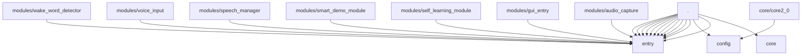

# 三花聚顶项目代码健康度扫描报告

**扫描目录**: `/home/lufei/文档/聚核助手2.0`
**扫描时间**: 2025-07-21 10:27:46
**文件总数**: 357
**模块数量**: 60
**高风险文件**: 0

## 模块统计概览

| 模块名称 | 文件数 | 语法错误 | 函数 | 异步函数 | 类 | 注释行 | 代码行 | 注释率 | 平均复杂度 | 风险文件 |
|----------|--------|----------|------|----------|----|--------|--------|--------|------------|----------|
| . | 172 | 29 | 405 | 7 | 73 | 2144 | 4790 | 44.8% | 2.5 | 0 |
| .pytest_cache | 2 | 0 | 0 | 0 | 0 | 0 | 2 | 0.0% | 0.0 | 0 |
| .pytest_cache/v/cache | 1 | 0 | 0 | 0 | 0 | 0 | 1 | 0.0% | 0.0 | 0 |
| assets | 1 | 0 | 0 | 0 | 0 | 0 | 1 | 0.0% | 0.0 | 0 |
| certs | 1 | 0 | 0 | 0 | 0 | 0 | 1 | 0.0% | 0.0 | 0 |
| config | 2 | 0 | 0 | 0 | 0 | 19 | 18 | 105.6% | 0.0 | 0 |
| core | 24 | 11 | 70 | 1 | 21 | 292 | 627 | 46.6% | 1.4 | 0 |
| core/aicore | 4 | 1 | 8 | 0 | 3 | 22 | 75 | 29.3% | 2.0 | 0 |
| core/aicore/actions | 1 | 0 | 4 | 0 | 0 | 16 | 46 | 34.8% | 3.0 | 0 |
| core/core2_0 | 30 | 9 | 122 | 0 | 28 | 490 | 1410 | 34.8% | 3.6 | 0 |
| core/core2_0/sanhuatongyu/monitoring | 2 | 1 | 0 | 0 | 0 | 0 | 1 | 0.0% | 0.0 | 0 |
| core/system | 3 | 1 | 9 | 0 | 0 | 38 | 118 | 32.2% | 1.2 | 0 |
| entry | 4 | 0 | 39 | 0 | 4 | 213 | 514 | 41.4% | 2.4 | 0 |
| entry/gui_entry | 1 | 0 | 2 | 0 | 0 | 3 | 10 | 30.0% | 1.0 | 0 |
| external | 1 | 0 | 0 | 0 | 0 | 0 | 1 | 0.0% | 0.0 | 0 |
| external/cpp_example | 1 | 0 | 0 | 0 | 0 | 0 | 1 | 0.0% | 0.0 | 0 |
| gui | 7 | 1 | 13 | 0 | 5 | 22 | 127 | 17.3% | 1.9 | 0 |
| gui/widgets | 1 | 0 | 4 | 0 | 1 | 8 | 28 | 28.6% | 1.4 | 0 |
| logs | 1 | 0 | 0 | 0 | 0 | 0 | 1 | 0.0% | 0.0 | 0 |
| logs/code_reader | 1 | 0 | 0 | 0 | 0 | 0 | 1 | 0.0% | 0.0 | 0 |
| modules/audio_capture | 4 | 0 | 23 | 0 | 2 | 179 | 403 | 44.4% | 1.9 | 0 |
| modules/cli_entry | 1 | 0 | 2 | 0 | 0 | 3 | 10 | 30.0% | 1.0 | 0 |
| modules/code_executor | 3 | 1 | 2 | 0 | 3 | 4 | 13 | 30.8% | 1.0 | 0 |
| modules/code_inserter | 1 | 0 | 0 | 0 | 0 | 0 | 1 | 0.0% | 0.0 | 0 |
| modules/code_reviewer | 4 | 1 | 2 | 0 | 2 | 4 | 14 | 28.6% | 0.5 | 0 |
| modules/format_manager/1 | 1 | 0 | 0 | 0 | 0 | 0 | 1 | 0.0% | 0.0 | 0 |
| modules/gui_entry | 2 | 0 | 11 | 0 | 1 | 84 | 165 | 50.9% | 1.4 | 0 |
| modules/hello_module | 1 | 0 | 0 | 0 | 0 | 0 | 1 | 0.0% | 0.0 | 0 |
| modules/ju_wu | 4 | 2 | 10 | 0 | 1 | 62 | 79 | 78.5% | 2.3 | 0 |
| modules/ju_wu/rules | 1 | 0 | 0 | 0 | 0 | 0 | 1 | 0.0% | 0.0 | 0 |
| modules/juzi | 4 | 0 | 9 | 0 | 2 | 35 | 76 | 46.1% | 1.2 | 0 |
| modules/logbook/1 | 1 | 0 | 0 | 0 | 0 | 0 | 1 | 0.0% | 0.0 | 0 |
| modules/self_learning_module | 4 | 1 | 2 | 0 | 1 | 3 | 14 | 21.4% | 0.2 | 0 |
| modules/smart_demo_module | 4 | 1 | 2 | 0 | 0 | 3 | 14 | 21.4% | 0.2 | 0 |
| modules/speech_manager | 3 | 1 | 3 | 0 | 1 | 4 | 16 | 25.0% | 0.7 | 0 |
| modules/speech_manager/1 | 1 | 0 | 0 | 0 | 0 | 0 | 1 | 0.0% | 0.0 | 0 |
| modules/stt_module | 1 | 1 | 1 | 0 | 4 | 0 | 0 | 0.0% | 13.0 | 0 |
| modules/stt_module/1 | 1 | 0 | 0 | 0 | 0 | 0 | 1 | 0.0% | 0.0 | 0 |
| modules/system_control/1 | 1 | 0 | 0 | 0 | 0 | 0 | 1 | 0.0% | 0.0 | 0 |
| modules/system_monitor | 2 | 1 | 0 | 0 | 0 | 0 | 1 | 0.0% | 0.0 | 0 |
| modules/test_module | 1 | 0 | 12 | 0 | 1 | 77 | 134 | 57.5% | 2.5 | 0 |
| modules/test_module/1 | 1 | 0 | 0 | 0 | 0 | 0 | 1 | 0.0% | 0.0 | 0 |
| modules/voice_input | 3 | 0 | 4 | 1 | 0 | 36 | 46 | 78.3% | 0.8 | 0 |
| modules/wake_word_detector | 3 | 2 | 2 | 0 | 7 | 0 | 3 | 0.0% | 16.0 | 0 |
| modules/wake_word_detector/1 | 1 | 0 | 0 | 0 | 0 | 0 | 1 | 0.0% | 0.0 | 0 |
| ollama_models | 5 | 0 | 0 | 0 | 0 | 0 | 5 | 0.0% | 0.0 | 0 |
| ollama_models/manifests/registry.ollama.ai/library/llama3 | 1 | 0 | 0 | 0 | 0 | 0 | 1 | 0.0% | 0.0 | 0 |
| recordings | 1 | 0 | 0 | 0 | 0 | 0 | 1 | 0.0% | 0.0 | 0 |
| rollback_snapshots | 5 | 0 | 25 | 0 | 4 | 103 | 237 | 43.5% | 2.8 | 0 |
| rollback_snapshots/backup/backup_20250629_215816_94cd3d | 4 | 2 | 17 | 0 | 3 | 122 | 223 | 54.7% | 2.5 | 0 |
| rollback_snapshots/snapshot_20250629_215118_795f59e1 | 8 | 1 | 45 | 0 | 9 | 186 | 420 | 44.3% | 3.2 | 0 |
| rollback_snapshots/snapshot_20250629_215407_65d62c0e | 4 | 0 | 35 | 0 | 3 | 172 | 330 | 52.1% | 2.7 | 0 |
| rollback_snapshots/snapshot_20250629_215816_c3d93551 | 8 | 1 | 49 | 0 | 7 | 236 | 480 | 49.2% | 2.5 | 0 |
| runtime | 1 | 0 | 0 | 0 | 0 | 0 | 1 | 0.0% | 0.0 | 0 |
| runtime/logs | 1 | 0 | 0 | 0 | 0 | 0 | 1 | 0.0% | 0.0 | 0 |
| scaffold | 1 | 1 | 3 | 0 | 0 | 0 | 0 | 0.0% | 9.0 | 0 |
| tests | 1 | 0 | 1 | 0 | 0 | 6 | 19 | 31.6% | 8.0 | 0 |
| tests/.pytest_cache | 1 | 0 | 0 | 0 | 0 | 0 | 1 | 0.0% | 0.0 | 0 |
| tests/.pytest_cache/v | 1 | 0 | 0 | 0 | 0 | 0 | 1 | 0.0% | 0.0 | 0 |
| third_party | 2 | 0 | 0 | 0 | 0 | 0 | 2 | 0.0% | 0.0 | 0 |

## 项目总体统计

- **文件总数**: 357
- **语法错误文件**: 69 (19.3%)
- **高风险文件**: 0
- **函数总数**: 936
- **异步函数**: 9
- **类总数**: 186
- **注释行**: 4586
- **代码行**: 10493
- **平均复杂度**: 2.3
- **注释率**: 43.7%

## 模块依赖关系

## 详细文件清单

| 文件路径 | 模块 | 风险等级 | 语法正确 | 函数 | 异步函数 | 类 | 注释行 | 代码行 | 复杂度 |
|----------|------|----------|----------|------|----------|----|--------|--------|--------|
| gui/utils/voice_queue.py | . | 🟨 MEDIUM | ✓ | 5 | 1 | 1 | 7 | 72 | 7.9 |
| gui/widgets/background_manager.py | gui | 🟨 MEDIUM | ✓ | 3 | 0 | 1 | 1 | 30 | 3.5 |
| jindouyun_particles.py | . | 🟨 MEDIUM | ✓ | 5 | 0 | 1 | 7 | 75 | 2.3 |
| core/aicore/command_router.py | . | 🟨 MEDIUM | ✓ | 1 | 0 | 1 | 0 | 4 | 1.0 |
| __init__.py | . | 🟨 MEDIUM | ✓ | 0 | 0 | 0 | 0 | 1 | 0.0 |
| data/__init__.py | . | 🟨 MEDIUM | ✓ | 0 | 0 | 0 | 0 | 1 | 0.0 |
| assets/__init__.py | assets | 🟨 MEDIUM | ✓ | 0 | 0 | 0 | 0 | 1 | 0.0 |
| utils/__init__.py | . | 🟨 MEDIUM | ✓ | 0 | 0 | 0 | 0 | 1 | 0.0 |
| rollback_snapshots/__init__.py | rollback_snapshots | 🟨 MEDIUM | ✓ | 0 | 0 | 0 | 0 | 1 | 0.0 |
| rollback_snapshots/snapshot_20250629_215118_795f59e1/__init__.py | . | 🟨 MEDIUM | ✓ | 0 | 0 | 0 | 0 | 1 | 0.0 |
| rollback_snapshots/snapshot_20250629_215407_65d62c0e/__init__.py | . | 🟨 MEDIUM | ✓ | 0 | 0 | 0 | 0 | 1 | 0.0 |
| rollback_snapshots/snapshot_20250629_215816_c3d93551/__init__.py | rollback_snapshots/snapshot_20250629_215816_c3d93551 | 🟨 MEDIUM | ✓ | 0 | 0 | 0 | 0 | 1 | 0.0 |
| rollback_snapshots/backup/__init__.py | . | 🟨 MEDIUM | ✓ | 0 | 0 | 0 | 0 | 1 | 0.0 |
| rollback_snapshots/backup/backup_20250629_215816_94cd3d/__init__.py | . | 🟨 MEDIUM | ✓ | 0 | 0 | 0 | 0 | 1 | 0.0 |
| recordings/__init__.py | recordings | 🟨 MEDIUM | ✓ | 0 | 0 | 0 | 0 | 1 | 0.0 |
| runtime/__init__.py | . | 🟨 MEDIUM | ✓ | 0 | 0 | 0 | 0 | 1 | 0.0 |
| runtime/logs/__init__.py | runtime/logs | 🟨 MEDIUM | ✓ | 0 | 0 | 0 | 0 | 1 | 0.0 |
| runtime/temp/__init__.py | . | 🟨 MEDIUM | ✓ | 0 | 0 | 0 | 0 | 1 | 0.0 |
| runtime/recordings/__init__.py | runtime | 🟨 MEDIUM | ✓ | 0 | 0 | 0 | 0 | 1 | 0.0 |
| external/__init__.py | . | 🟨 MEDIUM | ✓ | 0 | 0 | 0 | 0 | 1 | 0.0 |
| external/rust_example/__init__.py | external | 🟨 MEDIUM | ✓ | 0 | 0 | 0 | 0 | 1 | 0.0 |
| external/go_example/__init__.py | . | 🟨 MEDIUM | ✓ | 0 | 0 | 0 | 0 | 1 | 0.0 |
| external/cpp_example/__init__.py | external/cpp_example | 🟨 MEDIUM | ✓ | 0 | 0 | 0 | 0 | 1 | 0.0 |
| tests/__init__.py | . | 🟨 MEDIUM | ✓ | 0 | 0 | 0 | 0 | 1 | 0.0 |
| tests/.pytest_cache/__init__.py | . | 🟨 MEDIUM | ✓ | 0 | 0 | 0 | 0 | 1 | 0.0 |
| tests/.pytest_cache/v/__init__.py | tests/.pytest_cache/v | 🟨 MEDIUM | ✓ | 0 | 0 | 0 | 0 | 1 | 0.0 |
| tests/.pytest_cache/v/cache/__init__.py | tests/.pytest_cache | 🟨 MEDIUM | ✓ | 0 | 0 | 0 | 0 | 1 | 0.0 |
| docs/__init__.py | . | 🟨 MEDIUM | ✓ | 0 | 0 | 0 | 0 | 1 | 0.0 |
| logs/__init__.py | logs | 🟨 MEDIUM | ✓ | 0 | 0 | 0 | 0 | 1 | 0.0 |
| logs/voice_input/__init__.py | . | 🟨 MEDIUM | ✓ | 0 | 0 | 0 | 0 | 1 | 0.0 |
| logs/code_reader/__init__.py | logs/code_reader | 🟨 MEDIUM | ✓ | 0 | 0 | 0 | 0 | 1 | 0.0 |
| logs/code_inserter/__init__.py | . | 🟨 MEDIUM | ✓ | 0 | 0 | 0 | 0 | 1 | 0.0 |
| entry/__init__.py | . | 🟨 MEDIUM | ✓ | 0 | 0 | 0 | 0 | 1 | 0.0 |
| entry/cli_entry/__init__.py | . | 🟨 MEDIUM | ✓ | 0 | 0 | 0 | 0 | 4 | 0.0 |
| entry/gui_entry/__init__.py | . | 🟨 MEDIUM | ✓ | 0 | 0 | 0 | 0 | 3 | 0.0 |
| entry/voice_entry/__init__.py | entry | 🟨 MEDIUM | ✓ | 0 | 0 | 0 | 0 | 3 | 0.0 |
| entry/voice_input/__init__.py | . | 🟨 MEDIUM | ✓ | 0 | 0 | 0 | 0 | 3 | 0.0 |
| entry/voice_input/2/__init__.py | . | 🟨 MEDIUM | ✓ | 0 | 0 | 0 | 0 | 1 | 0.0 |
| core/__init__.py | . | 🟨 MEDIUM | ✓ | 0 | 0 | 0 | 0 | 1 | 0.0 |
| core/aicore/actions/__init__.py | core/aicore | 🟨 MEDIUM | ✓ | 0 | 0 | 0 | 0 | 1 | 0.0 |
| core/aicore/memory/__init__.py | core | 🟨 MEDIUM | ✓ | 0 | 0 | 0 | 0 | 2 | 0.0 |
| core/core2_0/__init__.py | core | 🟨 MEDIUM | ✓ | 0 | 0 | 0 | 0 | 1 | 0.0 |
| core/core2_0/self_heal/__init__.py | core | 🟨 MEDIUM | ✓ | 0 | 0 | 0 | 0 | 1 | 0.0 |
| core/core2_0/sanhuatongyu/module/__init__.py | core | 🟨 MEDIUM | ✓ | 0 | 0 | 0 | 0 | 1 | 0.0 |
| core/core2_0/sanhuatongyu/security/__init__.py | core/core2_0 | 🟨 MEDIUM | ✓ | 0 | 0 | 0 | 0 | 1 | 0.0 |
| core/core2_0/sanhuatongyu/monitoring/__init__.py | core/core2_0/sanhuatongyu/monitoring | 🟨 MEDIUM | ✓ | 0 | 0 | 0 | 0 | 1 | 0.0 |
| core/core2_0/sanhuatongyu/tests/__init__.py | core/core2_0 | 🟨 MEDIUM | ✓ | 0 | 0 | 0 | 0 | 1 | 0.0 |
| core/core2_0/sanhuatongyu/tests/unit/__init__.py | core/core2_0 | 🟨 MEDIUM | ✓ | 0 | 0 | 0 | 0 | 1 | 0.0 |
| core/core2_0/sanhuatongyu/tests/integration/__init__.py | core/core2_0 | 🟨 MEDIUM | ✓ | 0 | 0 | 0 | 0 | 1 | 0.0 |
| core/core2_0/sanhuatongyu/tests/benchmark/__init__.py | core/core2_0 | 🟨 MEDIUM | ✓ | 0 | 0 | 0 | 0 | 1 | 0.0 |
| core/core2_0/framework/__init__.py | core/core2_0 | 🟨 MEDIUM | ✓ | 0 | 0 | 0 | 0 | 1 | 0.0 |
| core/core2_0/certs/__init__.py | core/core2_0 | 🟨 MEDIUM | ✓ | 0 | 0 | 0 | 0 | 1 | 0.0 |
| scaffold/__init__.py | . | 🟨 MEDIUM | ✓ | 0 | 0 | 0 | 0 | 1 | 0.0 |
| modules/__init__.py | . | 🟨 MEDIUM | ✓ | 0 | 0 | 0 | 0 | 1 | 0.0 |
| modules/juzi/__init__.py | modules/juzi | 🟨 MEDIUM | ✓ | 0 | 0 | 0 | 0 | 1 | 0.0 |
| modules/juzi/icons/__init__.py | modules/juzi | 🟨 MEDIUM | ✓ | 0 | 0 | 0 | 0 | 1 | 0.0 |
| modules/ju_wu/__init__.py | . | 🟨 MEDIUM | ✓ | 0 | 0 | 0 | 0 | 4 | 0.0 |
| modules/ju_wu/rules/__init__.py | modules/ju_wu/rules | 🟨 MEDIUM | ✓ | 0 | 0 | 0 | 0 | 1 | 0.0 |
| modules/audio_capture/__init__.py | modules/audio_capture | 🟨 MEDIUM | ✓ | 0 | 0 | 0 | 0 | 3 | 0.0 |
| modules/audio_capture/1/__init__.py | modules/audio_capture | 🟨 MEDIUM | ✓ | 0 | 0 | 0 | 0 | 1 | 0.0 |
| modules/audio_consumer/__init__.py | . | 🟨 MEDIUM | ✓ | 0 | 0 | 0 | 0 | 3 | 0.0 |
| modules/audio_consumer/1/__init__.py | . | 🟨 MEDIUM | ✓ | 0 | 0 | 0 | 0 | 1 | 0.0 |
| modules/cli_entry/__init__.py | . | 🟨 MEDIUM | ✓ | 0 | 0 | 0 | 0 | 4 | 0.0 |
| modules/code_executor/1/__init__.py | . | 🟨 MEDIUM | ✓ | 0 | 0 | 0 | 0 | 1 | 0.0 |
| modules/code_inserter/1/__init__.py | modules/code_inserter | 🟨 MEDIUM | ✓ | 0 | 0 | 0 | 0 | 1 | 0.0 |
| modules/code_reader/1/__init__.py | . | 🟨 MEDIUM | ✓ | 0 | 0 | 0 | 0 | 1 | 0.0 |
| modules/code_reviewer/1/__init__.py | modules/code_reviewer | 🟨 MEDIUM | ✓ | 0 | 0 | 0 | 0 | 1 | 0.0 |
| modules/format_manager/1/__init__.py | modules/format_manager/1 | 🟨 MEDIUM | ✓ | 0 | 0 | 0 | 0 | 1 | 0.0 |
| modules/gui_entry/__init__.py | modules/gui_entry | 🟨 MEDIUM | ✓ | 0 | 0 | 0 | 0 | 3 | 0.0 |
| modules/hello_module/__init__.py | . | 🟨 MEDIUM | ✓ | 0 | 0 | 0 | 0 | 3 | 0.0 |
| modules/hello_module/1/__init__.py | modules/hello_module | 🟨 MEDIUM | ✓ | 0 | 0 | 0 | 0 | 1 | 0.0 |
| modules/language_bridge/__init__.py | . | 🟨 MEDIUM | ✓ | 0 | 0 | 0 | 0 | 3 | 0.0 |
| modules/language_bridge/1/__init__.py | . | 🟨 MEDIUM | ✓ | 0 | 0 | 0 | 0 | 1 | 0.0 |
| modules/logbook/1/__init__.py | modules/logbook/1 | 🟨 MEDIUM | ✓ | 0 | 0 | 0 | 0 | 1 | 0.0 |
| modules/model_engine/__init__.py | . | 🟨 MEDIUM | ✓ | 0 | 0 | 0 | 0 | 3 | 0.0 |
| modules/model_engine/1/__init__.py | . | 🟨 MEDIUM | ✓ | 0 | 0 | 0 | 0 | 1 | 0.0 |
| modules/music_manager/1/__init__.py | . | 🟨 MEDIUM | ✓ | 0 | 0 | 0 | 0 | 1 | 0.0 |
| modules/self_learning_module/__init__.py | modules/self_learning_module | 🟨 MEDIUM | ✓ | 0 | 0 | 0 | 0 | 3 | 0.0 |
| modules/self_learning_module/1/__init__.py | modules/self_learning_module | 🟨 MEDIUM | ✓ | 0 | 0 | 0 | 0 | 1 | 0.0 |
| modules/smart_demo_module/__init__.py | modules/smart_demo_module | 🟨 MEDIUM | ✓ | 0 | 0 | 0 | 0 | 3 | 0.0 |
| modules/smart_demo_module/1/__init__.py | modules/smart_demo_module | 🟨 MEDIUM | ✓ | 0 | 0 | 0 | 0 | 1 | 0.0 |
| modules/speech_manager/1/__init__.py | modules/speech_manager/1 | 🟨 MEDIUM | ✓ | 0 | 0 | 0 | 0 | 1 | 0.0 |
| modules/stt_module/__init__.py | . | 🟨 MEDIUM | ✓ | 0 | 0 | 0 | 0 | 3 | 0.0 |
| modules/stt_module/1/__init__.py | modules/stt_module/1 | 🟨 MEDIUM | ✓ | 0 | 0 | 0 | 0 | 1 | 0.0 |
| modules/system_control/__init__.py | . | 🟨 MEDIUM | ✓ | 0 | 0 | 0 | 0 | 3 | 0.0 |
| modules/system_control/1/__init__.py | modules/system_control/1 | 🟨 MEDIUM | ✓ | 0 | 0 | 0 | 0 | 1 | 0.0 |
| modules/system_monitor/1/__init__.py | modules/system_monitor | 🟨 MEDIUM | ✓ | 0 | 0 | 0 | 0 | 1 | 0.0 |
| modules/test_module/__init__.py | . | 🟨 MEDIUM | ✓ | 0 | 0 | 0 | 0 | 3 | 0.0 |
| modules/test_module/1/__init__.py | modules/test_module/1 | 🟨 MEDIUM | ✓ | 0 | 0 | 0 | 0 | 1 | 0.0 |
| modules/voice_entry/__init__.py | . | 🟨 MEDIUM | ✓ | 0 | 0 | 0 | 0 | 3 | 0.0 |
| modules/voice_input/__init__.py | modules/voice_input | 🟨 MEDIUM | ✓ | 0 | 0 | 0 | 0 | 3 | 0.0 |
| modules/voice_input/2/__init__.py | modules/voice_input | 🟨 MEDIUM | ✓ | 0 | 0 | 0 | 0 | 1 | 0.0 |
| modules/wake_word_detector/__init__.py | modules/wake_word_detector | 🟨 MEDIUM | ✓ | 0 | 0 | 0 | 0 | 3 | 0.0 |
| modules/wake_word_detector/1/__init__.py | modules/wake_word_detector/1 | 🟨 MEDIUM | ✓ | 0 | 0 | 0 | 0 | 1 | 0.0 |
| modules/reply_dispatcher/__init__.py | . | 🟨 MEDIUM | ✓ | 0 | 0 | 0 | 0 | 2 | 0.0 |
| .pytest_cache/__init__.py | .pytest_cache | 🟨 MEDIUM | ✓ | 0 | 0 | 0 | 0 | 1 | 0.0 |
| .pytest_cache/v/__init__.py | .pytest_cache | 🟨 MEDIUM | ✓ | 0 | 0 | 0 | 0 | 1 | 0.0 |
| .pytest_cache/v/cache/__init__.py | .pytest_cache/v/cache | 🟨 MEDIUM | ✓ | 0 | 0 | 0 | 0 | 1 | 0.0 |
| third_party/__init__.py | third_party | 🟨 MEDIUM | ✓ | 0 | 0 | 0 | 0 | 1 | 0.0 |
| third_party/ollama/__init__.py | third_party | 🟨 MEDIUM | ✓ | 0 | 0 | 0 | 0 | 1 | 0.0 |
| ollama_bin/__init__.py | . | 🟨 MEDIUM | ✓ | 0 | 0 | 0 | 0 | 1 | 0.0 |
| ollama_data/__init__.py | . | 🟨 MEDIUM | ✓ | 0 | 0 | 0 | 0 | 1 | 0.0 |
| ollama_models/__init__.py | ollama_models | 🟨 MEDIUM | ✓ | 0 | 0 | 0 | 0 | 1 | 0.0 |
| ollama_models/blobs/__init__.py | ollama_models | 🟨 MEDIUM | ✓ | 0 | 0 | 0 | 0 | 1 | 0.0 |
| ollama_models/manifests/__init__.py | ollama_models | 🟨 MEDIUM | ✓ | 0 | 0 | 0 | 0 | 1 | 0.0 |
| ollama_models/manifests/registry.ollama.ai/__init__.py | ollama_models | 🟨 MEDIUM | ✓ | 0 | 0 | 0 | 0 | 1 | 0.0 |
| ollama_models/manifests/registry.ollama.ai/library/__init__.py | ollama_models | 🟨 MEDIUM | ✓ | 0 | 0 | 0 | 0 | 1 | 0.0 |
| ollama_models/manifests/registry.ollama.ai/library/llama3/__init__.py | ollama_models/manifests/registry.ollama.ai/library/llama3 | 🟨 MEDIUM | ✓ | 0 | 0 | 0 | 0 | 1 | 0.0 |
| certs/__init__.py | certs | 🟨 MEDIUM | ✓ | 0 | 0 | 0 | 0 | 1 | 0.0 |
| modules/language_bridge/language_bridge.py | . | 🟩 LOW | ✗ | 6 | 5 | 0 | 0 | 0 | 90.0 |
| modules/wake_word_detector/wake_word_detector.py | modules/wake_word_detector | 🟩 LOW | ✗ | 2 | 0 | 7 | 0 | 0 | 48.0 |
| core/core2_0/reply_dispatcher.py | core/core2_0 | 🟩 LOW | ✗ | 13 | 0 | 7 | 0 | 0 | 38.0 |
| migrate_structure.py | . | 🟩 LOW | ✗ | 2 | 0 | 0 | 0 | 0 | 18.0 |
| modules/system_control/system_control.py | . | 🟩 LOW | ✗ | 5 | 0 | 1 | 0 | 0 | 18.0 |
| modules/stt_module/stt_module.py | modules/stt_module | 🟩 LOW | ✗ | 1 | 0 | 4 | 0 | 0 | 13.0 |
| core/core2_0/self_heal/rollback_manager.py | core/core2_0 | 🟩 LOW | ✓ | 10 | 0 | 1 | 92 | 215 | 12.1 |
| fix_log_path.py | . | 🟩 LOW | ✓ | 2 | 0 | 0 | 18 | 47 | 9.5 |
| core/core2_0/sanhuatongyu/module/manager.py | core/core2_0 | 🟩 LOW | ✓ | 17 | 0 | 2 | 68 | 232 | 9.1 |
| run_all_entries.py | . | 🟩 LOW | ✓ | 1 | 0 | 0 | 38 | 58 | 9.0 |
| scaffold/fix_all_imports.py | scaffold | 🟩 LOW | ✗ | 3 | 0 | 0 | 0 | 0 | 9.0 |
| juhe-main.py | . | 🟩 LOW | ✓ | 7 | 0 | 1 | 47 | 194 | 8.1 |
| tests/test_modules_loading.py | tests | 🟩 LOW | ✓ | 1 | 0 | 0 | 6 | 19 | 8.0 |
| core/core2_0/sanhuatongyu/events.py | core/core2_0 | 🟩 LOW | ✓ | 9 | 0 | 1 | 52 | 185 | 8.0 |
| modules/logbook/logbook.py | . | 🟩 LOW | ✓ | 24 | 0 | 2 | 236 | 447 | 7.9 |
| core/core2_0/module_loader.py | core/core2_0 | 🟩 LOW | ✓ | 19 | 0 | 2 | 84 | 245 | 7.5 |
| core/core2_0/sanhuatongyu/monitoring/metrics.py | core | 🟩 LOW | ✓ | 15 | 0 | 2 | 52 | 153 | 7.5 |
| rule_trainer.py | . | 🟩 LOW | ✗ | 3 | 0 | 0 | 0 | 0 | 7.0 |
| mysterious_entry_tool.py | . | 🟩 LOW | ✓ | 4 | 0 | 0 | 49 | 100 | 7.0 |
| fix_relative_imports.py | . | 🟩 LOW | ✓ | 2 | 0 | 0 | 16 | 28 | 7.0 |
| fix_imports.py | . | 🟩 LOW | ✓ | 1 | 0 | 0 | 7 | 17 | 7.0 |
| modules/audio_capture/capture.py | modules/audio_capture | 🟩 LOW | ✓ | 21 | 0 | 2 | 176 | 389 | 6.6 |
| init_packages.py | . | 🟩 LOW | ✓ | 2 | 0 | 0 | 33 | 47 | 6.5 |
| rollback_snapshots/snapshot_20250629_215118_795f59e1/code_reader.py | rollback_snapshots/snapshot_20250629_215118_795f59e1 | 🟩 LOW | ✓ | 7 | 0 | 1 | 32 | 73 | 6.1 |
| rollback_snapshots/snapshot_20250629_215407_65d62c0e/code_reader.py | . | 🟩 LOW | ✓ | 7 | 0 | 1 | 32 | 73 | 6.1 |
| rollback_snapshots/snapshot_20250629_215816_c3d93551/code_reader.py | rollback_snapshots/snapshot_20250629_215816_c3d93551 | 🟩 LOW | ✓ | 7 | 0 | 1 | 32 | 73 | 6.1 |
| rollback_snapshots/backup/backup_20250629_215816_94cd3d/code_reader.py | rollback_snapshots/backup/backup_20250629_215816_94cd3d | 🟩 LOW | ✓ | 7 | 0 | 1 | 32 | 73 | 6.1 |
| replace_logging.py | . | 🟩 LOW | ✓ | 3 | 0 | 0 | 32 | 60 | 6.0 |
| trace_memory_summary_calls.py | . | 🟩 LOW | ✓ | 2 | 0 | 0 | 9 | 30 | 6.0 |
| tools/config_validator.py | . | 🟩 LOW | ✓ | 1 | 0 | 0 | 14 | 22 | 6.0 |
| rollback_snapshots/snapshot_20250629_215118_795f59e1/code_reviewer.py | rollback_snapshots/snapshot_20250629_215118_795f59e1 | 🟩 LOW | ✓ | 7 | 0 | 1 | 44 | 89 | 5.9 |
| rollback_snapshots/snapshot_20250629_215407_65d62c0e/code_reviewer.py | . | 🟩 LOW | ✓ | 7 | 0 | 1 | 44 | 89 | 5.9 |
| rollback_snapshots/snapshot_20250629_215816_c3d93551/code_reviewer.py | . | 🟩 LOW | ✓ | 7 | 0 | 1 | 44 | 89 | 5.9 |
| rollback_snapshots/backup/backup_20250629_215816_94cd3d/code_reviewer.py | rollback_snapshots | 🟩 LOW | ✓ | 7 | 0 | 1 | 44 | 89 | 5.9 |
| fix_log_calls.py | . | 🟩 LOW | ✓ | 3 | 0 | 0 | 14 | 52 | 5.7 |
| core/core2_0/self_heal/log_analyzer.py | core/core2_0 | 🟩 LOW | ✓ | 9 | 0 | 2 | 59 | 121 | 5.7 |
| fix_logger_extra_parens.py | . | 🟩 LOW | ✓ | 2 | 0 | 0 | 12 | 33 | 5.5 |
| core/core2_0/event_bus.py | core/core2_0 | 🟩 LOW | ✓ | 11 | 0 | 1 | 59 | 140 | 5.4 |
| module_standardizer.py | . | 🟩 LOW | ✓ | 7 | 0 | 0 | 74 | 114 | 5.3 |
| fix_logger_extra.py | . | 🟩 LOW | ✓ | 3 | 0 | 1 | 25 | 55 | 5.2 |
| fix_logger_calls.py | . | 🟩 LOW | ✓ | 4 | 0 | 1 | 15 | 57 | 5.2 |
| scan_old_imports.py | . | 🟩 LOW | ✓ | 2 | 0 | 0 | 26 | 39 | 5.0 |
| entry/voice_input/voice_input.py | . | 🟩 LOW | ✗ | 0 | 0 | 4 | 0 | 0 | 5.0 |
| core/core2_0/utils.py | core | 🟩 LOW | ✗ | 1 | 0 | 0 | 0 | 0 | 5.0 |
| modules/ju_wu/rule_trainer_gui.py | . | 🟩 LOW | ✗ | 2 | 0 | 0 | 0 | 0 | 5.0 |
| modules/ju_wu/rule_trainer_widget.py | modules/ju_wu | 🟩 LOW | ✗ | 2 | 0 | 0 | 0 | 0 | 5.0 |
| modules/voice_input/voice_input.py | . | 🟩 LOW | ✗ | 0 | 0 | 4 | 0 | 0 | 5.0 |
| tools/cert_fix_tool.py | . | 🟩 LOW | ✓ | 1 | 0 | 0 | 12 | 27 | 5.0 |
| core/aicore/actions/action_dispatcher.py | core/aicore | 🟩 LOW | ✓ | 5 | 0 | 1 | 18 | 47 | 4.7 |
| check_syntax.py | . | 🟩 LOW | ✓ | 2 | 0 | 0 | 4 | 29 | 4.5 |
| entry/voice_entry/voice_entry.py | entry | 🟩 LOW | ✓ | 30 | 0 | 4 | 163 | 388 | 4.5 |
| modules/voice_entry/voice_entry.py | . | 🟩 LOW | ✓ | 30 | 0 | 4 | 163 | 388 | 4.5 |
| install_missing_dependencies.py | . | 🟩 LOW | ✓ | 3 | 0 | 0 | 13 | 46 | 4.3 |
| fix_entry_import_paths.py | . | 🟩 LOW | ✓ | 3 | 0 | 0 | 18 | 29 | 4.3 |
| fix_cli_entry_path_and_dispatcher.py | . | 🟩 LOW | ✓ | 3 | 0 | 0 | 23 | 38 | 4.3 |
| gui/utils/typing_effect.py | gui | 🟩 LOW | ✓ | 5 | 0 | 1 | 11 | 59 | 4.3 |
| core/core2_0/self_heal/self_healing_scheduler.py | core | 🟩 LOW | ✓ | 5 | 0 | 1 | 25 | 53 | 4.3 |
| core/core2_0/cli.py | core/core2_0 | 🟩 LOW | ✓ | 9 | 0 | 1 | 33 | 105 | 4.2 |
| batch_update_entry_points.py | . | 🟩 LOW | ✓ | 4 | 0 | 0 | 17 | 52 | 4.0 |
| sanhua_self_healer.py | . | 🟩 LOW | ✓ | 7 | 0 | 0 | 26 | 93 | 4.0 |
| entry/register_and_run_entries.py | entry | 🟩 LOW | ✓ | 5 | 0 | 0 | 30 | 73 | 4.0 |
| core/core2_0/sanhuatongyu/module/meta.py | core/core2_0 | 🟩 LOW | ✓ | 3 | 0 | 1 | 12 | 31 | 4.0 |
| tools/import_checker.py | . | 🟩 LOW | ✓ | 1 | 0 | 0 | 6 | 17 | 4.0 |
| rollback_snapshots/snapshot_20250629_215118_795f59e1/code_inserter.py | rollback_snapshots/snapshot_20250629_215118_795f59e1 | 🟩 LOW | ✓ | 6 | 0 | 1 | 34 | 61 | 3.9 |
| rollback_snapshots/snapshot_20250629_215407_65d62c0e/code_inserter.py | . | 🟩 LOW | ✓ | 6 | 0 | 1 | 34 | 61 | 3.9 |
| rollback_snapshots/snapshot_20250629_215816_c3d93551/code_inserter.py | . | 🟩 LOW | ✓ | 6 | 0 | 1 | 34 | 61 | 3.9 |
| rollback_snapshots/backup/backup_20250629_215816_94cd3d/code_inserter.py | rollback_snapshots | 🟩 LOW | ✓ | 6 | 0 | 1 | 34 | 61 | 3.9 |
| fix_all_issues.py | . | 🟩 LOW | ✓ | 4 | 0 | 0 | 30 | 70 | 3.8 |
| modules/ju_wu/intent_router.py | . | 🟩 LOW | ✓ | 4 | 0 | 1 | 21 | 35 | 3.8 |
| rollback_snapshots/snapshot_20250629_215118_795f59e1/system_control.py | . | 🟩 LOW | ✓ | 10 | 0 | 0 | 90 | 150 | 3.7 |
| rollback_snapshots/snapshot_20250629_215407_65d62c0e/system_control.py | rollback_snapshots/snapshot_20250629_215407_65d62c0e | 🟩 LOW | ✓ | 10 | 0 | 0 | 90 | 150 | 3.7 |
| rollback_snapshots/snapshot_20250629_215816_c3d93551/system_control.py | rollback_snapshots/snapshot_20250629_215816_c3d93551 | 🟩 LOW | ✓ | 10 | 0 | 0 | 90 | 150 | 3.7 |
| rollback_snapshots/backup/backup_20250629_215816_94cd3d/system_control.py | rollback_snapshots/backup/backup_20250629_215816_94cd3d | 🟩 LOW | ✓ | 10 | 0 | 0 | 90 | 150 | 3.7 |
| core/system/system_control.py | core/system | 🟩 LOW | ✓ | 9 | 0 | 0 | 37 | 116 | 3.6 |
| fix_percent_format.py | . | 🟩 LOW | ✓ | 2 | 0 | 0 | 13 | 34 | 3.5 |
| startup_fix.py | . | 🟩 LOW | ✓ | 2 | 0 | 0 | 9 | 27 | 3.5 |
| core/aicore/context_manager.py | core/aicore | 🟩 LOW | ✓ | 3 | 0 | 1 | 4 | 27 | 3.5 |
| core/core2_0/sanhuatongyu/events/event_bus_class_file.py | core/core2_0 | 🟩 LOW | ✓ | 4 | 0 | 1 | 7 | 23 | 3.4 |
| rollback_snapshots/snapshot_20250629_215118_795f59e1/music_manager.py | rollback_snapshots/snapshot_20250629_215118_795f59e1 | 🟩 LOW | ✓ | 7 | 0 | 2 | 32 | 76 | 3.3 |
| rollback_snapshots/snapshot_20250629_215407_65d62c0e/music_manager.py | . | 🟩 LOW | ✓ | 7 | 0 | 2 | 32 | 76 | 3.3 |
| rollback_snapshots/snapshot_20250629_215816_c3d93551/music_manager.py | rollback_snapshots/snapshot_20250629_215816_c3d93551 | 🟩 LOW | ✓ | 7 | 0 | 2 | 32 | 76 | 3.3 |
| rollback_snapshots/backup/backup_20250629_215816_94cd3d/music_manager.py | . | 🟩 LOW | ✓ | 7 | 0 | 2 | 32 | 76 | 3.3 |
| modules/ju_wu/rule_trainer_interactive.py | modules/ju_wu | 🟩 LOW | ✓ | 6 | 0 | 0 | 34 | 62 | 3.3 |
| rollback_snapshots/snapshot_20250629_215118_795f59e1/system_monitor.py | rollback_snapshots/snapshot_20250629_215118_795f59e1 | 🟩 LOW | ✓ | 9 | 0 | 2 | 18 | 76 | 3.2 |
| rollback_snapshots/snapshot_20250629_215407_65d62c0e/system_monitor.py | . | 🟩 LOW | ✓ | 9 | 0 | 2 | 18 | 76 | 3.2 |
| rollback_snapshots/snapshot_20250629_215816_c3d93551/system_monitor.py | . | 🟩 LOW | ✓ | 9 | 0 | 2 | 18 | 76 | 3.2 |
| rollback_snapshots/backup/backup_20250629_215816_94cd3d/system_monitor.py | rollback_snapshots | 🟩 LOW | ✓ | 9 | 0 | 2 | 18 | 76 | 3.2 |
| main_controller.py | . | 🟩 LOW | ✓ | 3 | 0 | 0 | 12 | 49 | 3.0 |
| module_loader.py | . | 🟩 LOW | ✓ | 4 | 0 | 1 | 12 | 36 | 3.0 |
| entry/cli_entry/cli_entry.py | . | 🟩 LOW | ✗ | 0 | 0 | 4 | 0 | 0 | 3.0 |
| entry/gui_entry/gui_main.py | . | 🟩 LOW | ✓ | 10 | 0 | 1 | 76 | 159 | 3.0 |
| core/aicore/actions/action_handlers.py | core/aicore/actions | 🟩 LOW | ✓ | 4 | 0 | 0 | 16 | 46 | 3.0 |
| core/core2_0/jujue_module_generator.py | core | 🟩 LOW | ✓ | 3 | 1 | 2 | 43 | 57 | 3.0 |
| core/core2_0/jumo_core.py | core/core2_0 | 🟩 LOW | ✗ | 0 | 0 | 2 | 0 | 0 | 3.0 |
| core/core2_0/sanhuatongyu/security/access_control.py | core | 🟩 LOW | ✓ | 6 | 0 | 1 | 9 | 30 | 3.0 |
| tools/path_dependency_checker.py | . | 🟩 LOW | ✓ | 1 | 0 | 0 | 6 | 16 | 3.0 |
| modules/gui_entry/gui_main.py | modules/gui_entry | 🟩 LOW | ✓ | 11 | 0 | 1 | 84 | 162 | 2.8 |
| cleanup_legacy.py | . | 🟩 LOW | ✓ | 3 | 0 | 0 | 8 | 23 | 2.7 |
| rollback_snapshots/snapshot_20250629_215118_795f59e1/code_executor.py | . | 🟩 LOW | ✓ | 9 | 0 | 1 | 29 | 81 | 2.6 |
| rollback_snapshots/snapshot_20250629_215407_65d62c0e/code_executor.py | rollback_snapshots/snapshot_20250629_215407_65d62c0e | 🟩 LOW | ✓ | 9 | 0 | 1 | 29 | 81 | 2.6 |
| rollback_snapshots/snapshot_20250629_215816_c3d93551/code_executor.py | rollback_snapshots/snapshot_20250629_215816_c3d93551 | 🟩 LOW | ✓ | 9 | 0 | 1 | 29 | 81 | 2.6 |
| rollback_snapshots/backup/backup_20250629_215816_94cd3d/code_executor.py | . | 🟩 LOW | ✓ | 9 | 0 | 1 | 29 | 81 | 2.6 |
| modules/juzi/juzi_engine.py | modules/juzi | 🟩 LOW | ✓ | 4 | 0 | 1 | 17 | 31 | 2.6 |
| core/core2_0/sanhuatongyu/logger.py | core | 🟩 LOW | ✓ | 13 | 0 | 3 | 26 | 80 | 2.5 |
| modules/test_module/test_module.py | modules/test_module | 🟩 LOW | ✓ | 12 | 0 | 1 | 77 | 134 | 2.5 |
| rollback_snapshots/snapshot_20250629_215118_795f59e1/logbook.py | . | 🟩 LOW | ✓ | 10 | 0 | 1 | 34 | 64 | 2.4 |
| rollback_snapshots/snapshot_20250629_215407_65d62c0e/logbook.py | rollback_snapshots/snapshot_20250629_215407_65d62c0e | 🟩 LOW | ✓ | 10 | 0 | 1 | 34 | 64 | 2.4 |
| rollback_snapshots/snapshot_20250629_215816_c3d93551/logbook.py | rollback_snapshots/snapshot_20250629_215816_c3d93551 | 🟩 LOW | ✓ | 10 | 0 | 1 | 34 | 64 | 2.4 |
| rollback_snapshots/backup/backup_20250629_215816_94cd3d/logbook.py | . | 🟩 LOW | ✓ | 10 | 0 | 1 | 34 | 64 | 2.4 |
| entry/voice_input/module.py | . | 🟩 LOW | ✓ | 4 | 1 | 0 | 36 | 42 | 2.4 |
| core/core2_0/trace_logger.py | core | 🟩 LOW | ✓ | 12 | 0 | 1 | 27 | 81 | 2.4 |
| modules/voice_input/module.py | modules/voice_input | 🟩 LOW | ✓ | 4 | 1 | 0 | 36 | 42 | 2.4 |
| gui/utils/system_monitor.py | gui | 🟩 LOW | ✓ | 2 | 0 | 1 | 2 | 15 | 2.3 |
| gui/widgets/chat_box.py | . | 🟩 LOW | ✓ | 2 | 0 | 1 | 17 | 27 | 2.3 |
| gui/widgets/status_panel.py | gui | 🟩 LOW | ✓ | 2 | 0 | 1 | 3 | 11 | 2.3 |
| core/core2_0/register_action.py | core | 🟩 LOW | ✓ | 13 | 0 | 1 | 107 | 156 | 2.3 |
| core/core2_0/sanhuatongyu/emergency_cli.py | core/core2_0 | 🟩 LOW | ✓ | 2 | 0 | 1 | 4 | 12 | 2.3 |
| core/core2_0/sanhuatongyu/security/rate_limiter.py | core/core2_0 | 🟩 LOW | ✓ | 5 | 0 | 1 | 9 | 37 | 2.3 |
| modules/juzi/juzi.py | modules/juzi | 🟩 LOW | ✓ | 5 | 0 | 1 | 18 | 43 | 2.2 |
| memory_retrieval.py | . | 🟩 LOW | ✓ | 3 | 0 | 1 | 18 | 46 | 2.0 |
| rollback_snapshots/snapshot_20250629_215118_795f59e1/format_manager.py | rollback_snapshots/snapshot_20250629_215118_795f59e1 | 🟩 LOW | ✓ | 6 | 0 | 1 | 19 | 35 | 2.0 |
| rollback_snapshots/snapshot_20250629_215407_65d62c0e/format_manager.py | rollback_snapshots/snapshot_20250629_215407_65d62c0e | 🟩 LOW | ✓ | 6 | 0 | 1 | 19 | 35 | 2.0 |
| rollback_snapshots/snapshot_20250629_215816_c3d93551/format_manager.py | rollback_snapshots/snapshot_20250629_215816_c3d93551 | 🟩 LOW | ✓ | 6 | 0 | 1 | 19 | 35 | 2.0 |
| rollback_snapshots/backup/backup_20250629_215816_94cd3d/format_manager.py | . | 🟩 LOW | ✓ | 6 | 0 | 1 | 19 | 35 | 2.0 |
| core/core2_0/sanhuatongyu/entry_dispatcher.py | core | 🟩 LOW | ✗ | 0 | 0 | 3 | 0 | 0 | 2.0 |
| modules/code_executor/code_executor.py | modules/code_executor | 🟩 LOW | ✗ | 0 | 0 | 3 | 0 | 0 | 2.0 |
| core/core2_0/sanhuatongyu/module/base.py | core/core2_0 | 🟩 LOW | ✓ | 11 | 0 | 1 | 9 | 52 | 1.8 |
| modules/cli_entry/cli_main.py | . | 🟩 LOW | ✓ | 19 | 0 | 1 | 79 | 127 | 1.7 |
| gui/widgets/voice_mode_overlay.py | gui/widgets | 🟩 LOW | ✓ | 4 | 0 | 1 | 8 | 28 | 1.4 |
| core/aicore/action_manager.py | . | 🟩 LOW | ✓ | 13 | 0 | 1 | 35 | 51 | 1.3 |
| entry/voice_entry/module.py | entry | 🟩 LOW | ✓ | 4 | 0 | 0 | 20 | 50 | 1.2 |
| modules/voice_entry/module.py | . | 🟩 LOW | ✓ | 4 | 0 | 0 | 20 | 50 | 1.2 |
| health_checker.py | . | 🟩 LOW | ✗ | 0 | 0 | 2 | 0 | 0 | 1.0 |
| gui/widgets/input_bar.py | . | 🟩 LOW | ✓ | 1 | 0 | 1 | 3 | 16 | 1.0 |
| gui/widgets/menu_bar.py | . | 🟩 LOW | ✓ | 1 | 0 | 1 | 15 | 32 | 1.0 |
| gui/widgets/__init__.py | gui | 🟩 LOW | ✓ | 1 | 0 | 1 | 1 | 5 | 1.0 |
| rollback_snapshots/snapshot_20250629_215118_795f59e1/hello_module.py | rollback_snapshots/snapshot_20250629_215118_795f59e1 | 🟩 LOW | ✓ | 3 | 0 | 0 | 7 | 10 | 1.0 |
| rollback_snapshots/snapshot_20250629_215407_65d62c0e/hello_module.py | . | 🟩 LOW | ✓ | 3 | 0 | 0 | 7 | 10 | 1.0 |
| rollback_snapshots/snapshot_20250629_215816_c3d93551/hello_module.py | . | 🟩 LOW | ✓ | 3 | 0 | 0 | 7 | 10 | 1.0 |
| rollback_snapshots/backup/backup_20250629_215816_94cd3d/hello_module.py | rollback_snapshots | 🟩 LOW | ✓ | 3 | 0 | 0 | 7 | 10 | 1.0 |
| tests/test_aicore.py | . | 🟩 LOW | ✓ | 1 | 0 | 0 | 1 | 7 | 1.0 |
| tests/test_entry_dispatcher.py | . | 🟩 LOW | ✓ | 1 | 0 | 0 | 1 | 4 | 1.0 |
| entry/cli_entry/module.py | . | 🟩 LOW | ✓ | 2 | 0 | 0 | 3 | 10 | 1.0 |
| entry/gui_entry/module.py | entry/gui_entry | 🟩 LOW | ✓ | 2 | 0 | 0 | 3 | 10 | 1.0 |
| core/aicore/circuit_breaker.py | . | 🟩 LOW | ✓ | 7 | 0 | 1 | 3 | 19 | 1.0 |
| core/core2_0/sanhuatongyu/security/sandbox.py | core | 🟩 LOW | ✓ | 2 | 0 | 1 | 1 | 8 | 1.0 |
| scaffold/health_checker.py | . | 🟩 LOW | ✗ | 0 | 0 | 2 | 0 | 0 | 1.0 |
| modules/ju_wu/action_mapper.py | modules/ju_wu | 🟩 LOW | ✓ | 2 | 0 | 0 | 28 | 17 | 1.0 |
| modules/audio_capture/module.py | modules/audio_capture | 🟩 LOW | ✓ | 2 | 0 | 0 | 3 | 10 | 1.0 |
| modules/audio_consumer/module.py | . | 🟩 LOW | ✓ | 2 | 0 | 0 | 3 | 10 | 1.0 |
| modules/cli_entry/module.py | modules/cli_entry | 🟩 LOW | ✓ | 2 | 0 | 0 | 3 | 10 | 1.0 |
| modules/code_executor/module.py | modules/code_executor | 🟩 LOW | ✓ | 2 | 0 | 0 | 3 | 10 | 1.0 |
| modules/code_inserter/module.py | . | 🟩 LOW | ✓ | 2 | 0 | 0 | 3 | 10 | 1.0 |
| modules/code_reader/module.py | . | 🟩 LOW | ✓ | 2 | 0 | 0 | 3 | 10 | 1.0 |
| modules/code_reader/code_reader.py | . | 🟩 LOW | ✗ | 0 | 0 | 2 | 0 | 0 | 1.0 |
| modules/code_reviewer/module.py | modules/code_reviewer | 🟩 LOW | ✓ | 2 | 0 | 0 | 3 | 10 | 1.0 |
| modules/code_reviewer/code_reviewer.py | modules/code_reviewer | 🟩 LOW | ✗ | 0 | 0 | 2 | 0 | 0 | 1.0 |
| modules/format_manager/module.py | . | 🟩 LOW | ✓ | 2 | 0 | 0 | 3 | 10 | 1.0 |
| modules/gui_entry/module.py | . | 🟩 LOW | ✓ | 2 | 0 | 0 | 3 | 10 | 1.0 |
| modules/hello_module/hello_module.py | . | 🟩 LOW | ✓ | 3 | 0 | 0 | 16 | 30 | 1.0 |
| modules/hello_module/module.py | . | 🟩 LOW | ✓ | 2 | 0 | 0 | 3 | 10 | 1.0 |
| modules/language_bridge/module.py | . | 🟩 LOW | ✓ | 2 | 0 | 0 | 3 | 10 | 1.0 |
| modules/logbook/module.py | . | 🟩 LOW | ✓ | 2 | 0 | 0 | 3 | 10 | 1.0 |
| modules/model_engine/module.py | . | 🟩 LOW | ✓ | 2 | 0 | 0 | 3 | 10 | 1.0 |
| modules/music_manager/module.py | . | 🟩 LOW | ✓ | 2 | 0 | 0 | 3 | 10 | 1.0 |
| modules/self_learning_module/module.py | modules/self_learning_module | 🟩 LOW | ✓ | 2 | 0 | 0 | 3 | 10 | 1.0 |
| modules/smart_demo_module/module.py | modules/smart_demo_module | 🟩 LOW | ✓ | 2 | 0 | 0 | 3 | 10 | 1.0 |
| modules/speech_manager/module.py | modules/speech_manager | 🟩 LOW | ✓ | 2 | 0 | 0 | 3 | 10 | 1.0 |
| modules/speech_manager/__init__.py | modules/speech_manager | 🟩 LOW | ✓ | 1 | 0 | 1 | 1 | 6 | 1.0 |
| modules/stt_module/module.py | . | 🟩 LOW | ✓ | 2 | 0 | 0 | 3 | 10 | 1.0 |
| modules/system_control/module.py | . | 🟩 LOW | ✓ | 2 | 0 | 0 | 3 | 10 | 1.0 |
| modules/system_monitor/module.py | . | 🟩 LOW | ✓ | 2 | 0 | 0 | 3 | 10 | 1.0 |
| modules/test_module/module.py | . | 🟩 LOW | ✓ | 2 | 0 | 0 | 3 | 10 | 1.0 |
| modules/wake_word_detector/module.py | . | 🟩 LOW | ✓ | 3 | 0 | 0 | 13 | 19 | 1.0 |
| modules/reply_dispatcher/dispatcher.py | . | 🟩 LOW | ✓ | 1 | 0 | 1 | 1 | 4 | 1.0 |
| modules/reply_dispatcher/register_actions.py | . | 🟩 LOW | ✓ | 1 | 0 | 0 | 2 | 3 | 1.0 |
| create_memory_module.py | . | 🟩 LOW | ✓ | 0 | 0 | 0 | 63 | 33 | 0.0 |
| chatgpt_importer.py | . | 🟩 LOW | ✗ | 0 | 0 | 0 | 0 | 0 | 0.0 |
| audio_test.py | . | 🟩 LOW | ✓ | 0 | 0 | 0 | 2 | 7 | 0.0 |
| update_entry_points.py | . | 🟩 LOW | ✗ | 0 | 0 | 0 | 0 | 0 | 0.0 |
| test_mic.py | . | 🟩 LOW | ✓ | 0 | 0 | 0 | 9 | 20 | 0.0 |
| fix_ai_config.py | . | 🟩 LOW | ✓ | 0 | 0 | 0 | 16 | 23 | 0.0 |
| replace_imports.py | . | 🟩 LOW | ✓ | 0 | 0 | 0 | 6 | 20 | 0.0 |
| config.py | config | 🟩 LOW | ✓ | 0 | 0 | 0 | 1 | 2 | 0.0 |
| gui/aicore_gui.py | . | 🟩 LOW | ✗ | 0 | 0 | 0 | 0 | 0 | 0.0 |
| gui/__init__.py | gui | 🟩 LOW | ✓ | 0 | 0 | 0 | 4 | 7 | 0.0 |
| gui/main_gui.py | gui | 🟩 LOW | ✗ | 0 | 0 | 0 | 0 | 0 | 0.0 |
| gui/utils/__init__.py | . | 🟩 LOW | ✓ | 0 | 0 | 0 | 5 | 3 | 0.0 |
| rollback_snapshots/snapshot_20250629_215118_795f59e1/model_engine.py | rollback_snapshots/snapshot_20250629_215118_795f59e1 | 🟩 LOW | ✗ | 0 | 0 | 1 | 0 | 0 | 0.0 |
| rollback_snapshots/snapshot_20250629_215118_795f59e1/speech_manager.py | . | 🟩 LOW | ✗ | 0 | 0 | 1 | 0 | 0 | 0.0 |
| rollback_snapshots/snapshot_20250629_215407_65d62c0e/model_engine.py | . | 🟩 LOW | ✗ | 0 | 0 | 1 | 0 | 0 | 0.0 |
| rollback_snapshots/snapshot_20250629_215407_65d62c0e/speech_manager.py | . | 🟩 LOW | ✗ | 0 | 0 | 1 | 0 | 0 | 0.0 |
| rollback_snapshots/snapshot_20250629_215816_c3d93551/model_engine.py | rollback_snapshots/snapshot_20250629_215816_c3d93551 | 🟩 LOW | ✗ | 0 | 0 | 1 | 0 | 0 | 0.0 |
| rollback_snapshots/snapshot_20250629_215816_c3d93551/speech_manager.py | . | 🟩 LOW | ✗ | 0 | 0 | 1 | 0 | 0 | 0.0 |
| rollback_snapshots/backup/backup_20250629_215816_94cd3d/model_engine.py | rollback_snapshots/backup/backup_20250629_215816_94cd3d | 🟩 LOW | ✗ | 0 | 0 | 1 | 0 | 0 | 0.0 |
| rollback_snapshots/backup/backup_20250629_215816_94cd3d/speech_manager.py | rollback_snapshots/backup/backup_20250629_215816_94cd3d | 🟩 LOW | ✗ | 0 | 0 | 1 | 0 | 0 | 0.0 |
| config/__init__.py | config | 🟩 LOW | ✓ | 0 | 0 | 0 | 18 | 16 | 0.0 |
| config/config.py | . | 🟩 LOW | ✓ | 0 | 0 | 0 | 18 | 16 | 0.0 |
| entry/add_entry_func.py | . | 🟩 LOW | ✓ | 0 | 0 | 0 | 4 | 10 | 0.0 |
| core/aicore/model_engine.py | . | 🟩 LOW | ✗ | 0 | 0 | 1 | 0 | 0 | 0.0 |
| core/aicore/health_monitor.py | . | 🟩 LOW | ✗ | 0 | 0 | 1 | 0 | 0 | 0.0 |
| core/aicore/__init__.py | . | 🟩 LOW | ✓ | 0 | 0 | 0 | 2 | 5 | 0.0 |
| core/aicore/aicore.py | . | 🟩 LOW | ✗ | 0 | 0 | 1 | 0 | 0 | 0.0 |
| core/aicore/memory/memory_engine.py | . | 🟩 LOW | ✗ | 0 | 0 | 1 | 0 | 0 | 0.0 |
| core/aicore/memory/memory_manager.py | core/aicore | 🟩 LOW | ✗ | 0 | 0 | 1 | 0 | 0 | 0.0 |
| core/core2_0/config_manager.py | core | 🟩 LOW | ✗ | 0 | 0 | 1 | 0 | 0 | 0.0 |
| core/core2_0/error_logger.py | core/core2_0 | 🟩 LOW | ✗ | 0 | 0 | 1 | 0 | 0 | 0.0 |
| core/core2_0/module_watcher.py | core/core2_0 | 🟩 LOW | ✗ | 0 | 0 | 1 | 0 | 0 | 0.0 |
| core/core2_0/module_manager.py | core | 🟩 LOW | ✗ | 0 | 0 | 1 | 0 | 0 | 0.0 |
| core/core2_0/logger.py | core/core2_0 | 🟩 LOW | ✗ | 0 | 0 | 1 | 0 | 0 | 0.0 |
| core/core2_0/action_dispatcher.py | core/core2_0 | 🟩 LOW | ✗ | 0 | 0 | 0 | 0 | 0 | 0.0 |
| core/core2_0/security_manager.py | core | 🟩 LOW | ✗ | 0 | 0 | 1 | 0 | 0 | 0.0 |
| core/core2_0/query_handler.py | core/core2_0 | 🟩 LOW | ✗ | 0 | 0 | 0 | 0 | 0 | 0.0 |
| core/core2_0/config.py | core/core2_0 | 🟩 LOW | ✓ | 0 | 0 | 0 | 1 | 2 | 0.0 |
| core/core2_0/sanhuatongyu/master.py | core | 🟩 LOW | ✗ | 0 | 0 | 1 | 0 | 0 | 0.0 |
| core/core2_0/sanhuatongyu/__init__.py | core | 🟩 LOW | ✓ | 0 | 0 | 0 | 2 | 4 | 0.0 |
| core/core2_0/sanhuatongyu/context.py | core | 🟩 LOW | ✗ | 0 | 0 | 1 | 0 | 0 | 0.0 |
| core/core2_0/sanhuatongyu/run_sanhuatongyu.py | core | 🟩 LOW | ✗ | 0 | 0 | 0 | 0 | 0 | 0.0 |
| core/core2_0/sanhuatongyu/system_module.py | core | 🟩 LOW | ✗ | 0 | 0 | 1 | 0 | 0 | 0.0 |
| core/core2_0/sanhuatongyu/config.py | core/core2_0 | 🟩 LOW | ✗ | 0 | 0 | 1 | 0 | 0 | 0.0 |
| core/core2_0/sanhuatongyu/utils.py | core | 🟩 LOW | ✗ | 0 | 0 | 0 | 0 | 0 | 0.0 |
| core/core2_0/sanhuatongyu/metrics.py | core | 🟩 LOW | ✗ | 0 | 0 | 0 | 0 | 0 | 0.0 |
| core/core2_0/sanhuatongyu/module/dependency_resolver.py | core/core2_0 | 🟩 LOW | ✗ | 0 | 0 | 0 | 0 | 0 | 0.0 |
| core/core2_0/sanhuatongyu/monitoring/thread_monitor.py | core/core2_0/sanhuatongyu/monitoring | 🟩 LOW | ✗ | 0 | 0 | 0 | 0 | 0 | 0.0 |
| core/core2_0/sanhuatongyu/events/__init__.py | core/core2_0 | 🟩 LOW | ✓ | 0 | 0 | 0 | 1 | 3 | 0.0 |
| core/system/system_sense.py | core/system | 🟩 LOW | ✗ | 0 | 0 | 0 | 0 | 0 | 0.0 |
| core/system/__init__.py | core/system | 🟩 LOW | ✓ | 0 | 0 | 0 | 1 | 2 | 0.0 |
| scaffold/standardize_modules.py | . | 🟩 LOW | ✓ | 0 | 0 | 0 | 21 | 40 | 0.0 |
| modules/ju_wu/juwu.py | modules/ju_wu | 🟩 LOW | ✗ | 0 | 0 | 1 | 0 | 0 | 0.0 |
| modules/audio_consumer/audio_consumer.py | . | 🟩 LOW | ✗ | 0 | 0 | 0 | 0 | 0 | 0.0 |
| modules/code_executor/__init__.py | modules/code_executor | 🟩 LOW | ✓ | 0 | 0 | 0 | 1 | 3 | 0.0 |
| modules/code_inserter/__init__.py | . | 🟩 LOW | ✓ | 0 | 0 | 0 | 1 | 3 | 0.0 |
| modules/code_inserter/code_inserter.py | . | 🟩 LOW | ✗ | 0 | 0 | 1 | 0 | 0 | 0.0 |
| modules/code_reader/__init__.py | . | 🟩 LOW | ✓ | 0 | 0 | 0 | 1 | 3 | 0.0 |
| modules/code_reviewer/__init__.py | modules/code_reviewer | 🟩 LOW | ✓ | 0 | 0 | 0 | 1 | 3 | 0.0 |
| modules/format_manager/__init__.py | . | 🟩 LOW | ✓ | 0 | 0 | 0 | 1 | 3 | 0.0 |
| modules/format_manager/format_manager.py | . | 🟩 LOW | ✗ | 0 | 0 | 1 | 0 | 0 | 0.0 |
| modules/logbook/logbook_manager.py | . | 🟩 LOW | ✓ | 0 | 0 | 0 | 3 | 10 | 0.0 |
| modules/logbook/__init__.py | . | 🟩 LOW | ✓ | 0 | 0 | 0 | 2 | 3 | 0.0 |
| modules/model_engine/model_engine.py | . | 🟩 LOW | ✗ | 0 | 0 | 1 | 0 | 0 | 0.0 |
| modules/music_manager/music_manager.py | . | 🟩 LOW | ✗ | 0 | 0 | 1 | 0 | 0 | 0.0 |
| modules/music_manager/__init__.py | . | 🟩 LOW | ✗ | 0 | 0 | 0 | 0 | 0 | 0.0 |
| modules/self_learning_module/self_learning_module.py | modules/self_learning_module | 🟩 LOW | ✗ | 0 | 0 | 1 | 0 | 0 | 0.0 |
| modules/smart_demo_module/smart_demo_module.py | modules/smart_demo_module | 🟩 LOW | ✗ | 0 | 0 | 0 | 0 | 0 | 0.0 |
| modules/speech_manager/speech_manager.py | modules/speech_manager | 🟩 LOW | ✗ | 0 | 0 | 0 | 0 | 0 | 0.0 |
| modules/system_monitor/system_monitor.py | . | 🟩 LOW | ✗ | 0 | 0 | 1 | 0 | 0 | 0.0 |
| modules/system_monitor/__init__.py | modules/system_monitor | 🟩 LOW | ✗ | 0 | 0 | 0 | 0 | 0 | 0.0 |
| modules/wake_word_detector/download_whisper_model.py | modules/wake_word_detector | 🟩 LOW | ✗ | 0 | 0 | 0 | 0 | 0 | 0.0 |